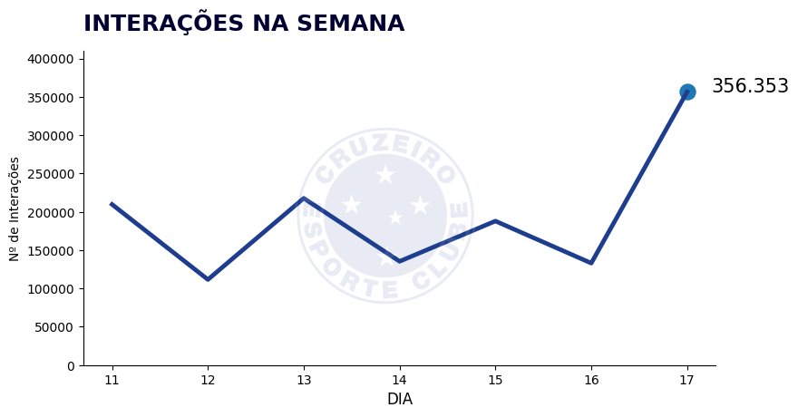

# Cruzeiro-Bot
Criação de um bot no twitter para extrair e publicar informações sobre o engajemento do Cruzeiro

Este projeto foi descontinuado por tempo indeterminado, mas volterei a ele em breve.
Para acessá-lo, entre no link: https://twitter.com/BotCruzeiro

Este bot publica de 3 em 3 horas o número de tweets que o Cruzeiro realizou no período bem como o número de likes e rt's destes tweets, além da variação quando comparada com a postagem anterior. Nesta publicação ele também mostra o número de seguidores do perfil oficial do Cruzeiro.

Semanalmente e Mensalmente o bot é capaz de publicar um gráfico personalizado com a evolução diária do engajemento celeste no Twitter, como o gráfico abaixo.

Todos os dias o bot publica uma nuvem de palavras com os termos mais associados ao nome Cruzeiro no twitter no dia em questão. Exemplo abaixo

Como podemos ver acima, todos os gráficos publicados são personalizados com elementos e cores do Cruzeiro.
